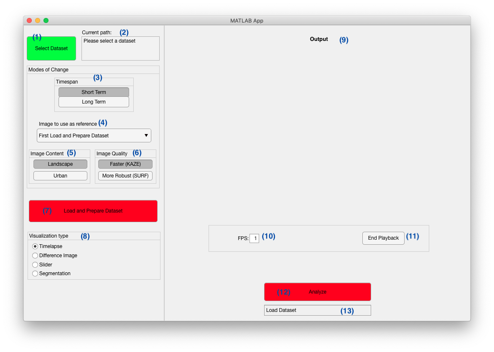

# G44_CV2021Challenge

## Starting the Graphical User Interface
To start the program, simply run the main.m file in MATLAB. The program requires the Computer Vision and Image Processing Toolbox to be installed.

## Graphical User Interface
The Graphical User Interface (GUI) allows the user to interact with the application with the aim of visualizing the change in multi-year satellite images of the same point on the earth. Here, the design of the application and the features presented are kept intuitive for all target audience and not only Computer Vision experts. Figure 1 highlights this design. In the following, a detailed breakdown of the features and their use cases is presented:
 *Figure 1*

## Dataset Selection:
Here the user will browse the data set folder that consists of a sequence of images (must be in .jpg format!) by pressing the “Select Dataset” (1) button. The folder path chosen will be displayed on the “Current path” (2) box. Once a dataset has been selected, the Load and Prepare Dataset button (7) will turn green. Once the desired settings (see below) have been selected, push this button to prepare the images for visualization.

## Load and Prepare Dataset:
When this button is pressed, if a path to a suitable folder has been selected, the program will load all the images in the folder and try to align them into the same orientation. It will also prepare a few things to make visualisation easier later. This step can take quite a while, so please be patient. The status indicator (13) under the analyze button (12) will provide information about the current status of the program.

## Mode of change: 
The app will enable the user to switch between 4 different mode of changes in two tab groups:
                
1. Image quality (6): If the dataset to be analyzed is good quality (all the images are oriented almost the same way, exposure is very similar, no perspective skew etc.) use the 'Faster' option. If the default 'Faster' option does not provide satisfactory results, switching to 'Robust' adds an extra preprocessing step and uses a different, more robust algorithm at the expense of processing time. The names of the algorithms used are shown in parentheses so that the Computer Vision audience gets a better understanding of what’s happening behind the scenes.
                
2. Timespan (3): If you wish to examine short term changes (ones that will be apparent between 2 consecutive images, select the default option 'short term.' Then, you will be able to pic any of the dataset images in the "Image to use as reference" dropdown (4) and compare it with the image directly after it. If you wish to examine longer term, more gradual change, select long term. This will automatically select the first and last image in the dataset to compare.
3. Image Content(5): This function is specifically for the segmentation visualization. It changes the algorithm from detecting ocean and coastlines or detecting changes in images of urban areas.

## Visualization Type: 
After the images have been analyzed, you can choose various ways of evaluating the dataset. Using the list box (8), the user will be able to choose one of three visualization modes and the application will update accordingly:
1. Timelapse: This is the default option. The idea behind this visualization mode is to parse the images of the selected location and perceive the slight change that keeps happening over a period of time. When this mode is selected, a parameters box under the output area will appear and it will be possible to end the time-lapse via “End Playback” button and to change the “FPS” (i.e Frame Per Second) of the output. Per default, the value of FPS is set to 1 frame per second.

2. Slider: The slider option allows the user to easily navigate between two images of the same location but from different years, this option was implemented in order to make it easier for the user to perceive the shifts in landscape that may occur. When clicking on the slider option, a slider will appear under the image. Moving or dragging the slider will display parts of the images side by side. 
                
3. Difference Image: This option will display the difference between the first and last image in the sequence to highlight the difference that occurred in the whole time period. Dark areas signify areas with high amounts of change between the images, while lighter areas signify less change. Furthermore, if the color has shifted over time, the shade of color change will also be displayed.
4. Segmentation: This visualisation method will take the image currently selected and perform segmentation analysis on it. Since there is a lot of output, this result opens in a new window. Depeding on the image content setting, it will try to identify either land and water along coastlines or buildings within cities and highlight them. 

## Output Section:
After selecting a dataset the “Analyze” (12) button will change its color from red to green. This gives the green light for the application to start by clicking this button. Besides, keep an eye on the “Progress bar” (13) beneath the button which will guide the user throughout the whole experience of using the app. Depending on the settings chosen, the output (9) will display the corresponding visualization.

